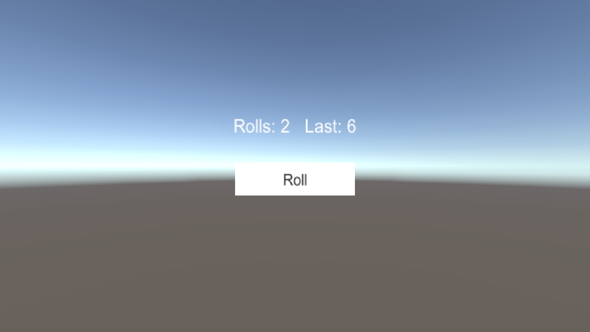

# vsa-consumer-unity

A Unity 6000.6 project that installs the UPM package `com.vsa.core` ([vsa-unity](https://github.com/MgCohen/vsa-unity)) from its git URL. It runs the dice sample of vsa-unity as a consumer does. It is the install check of the package.

## Install

`Packages/manifest.json` has the git URL with the package folder and a commit:

```json
"com.vsa.core": "https://github.com/MgCohen/vsa-unity.git?path=/Packages/com.vsa.core#<commit or tag>"
```

To test another version of the package, change the part after `#` to a commit, a branch or a tag. Unity installs the package again when the manifest changes.

## Content

| Path | Content |
|---|---|
| `Assets/DiceGame/` | The dice sample of vsa-unity, copied 1:1 with its `.meta` files |
| `Assets/DiceGame/Scenes/MainMenu.unity` | The first scene: a Start button |
| `Assets/DiceGame/Scenes/DiceGame.unity` | The game scene: the shell `DiceShell`, a Roll button and a label |
| `docs/images/` | Captures of the check |

## Check

1. Open the project in Unity 6000.6.6f1.
2. Open `Assets/DiceGame/Scenes/MainMenu.unity` and enter Play Mode.
3. Select Start, then select Roll two times.
4. The label shows `Rolls: 2` and the last roll. The Console has no errors.


